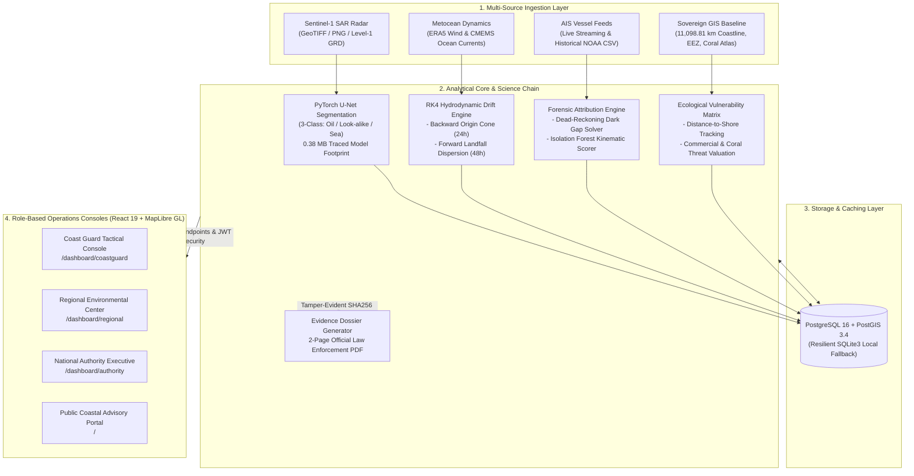

# SARVAS: Satellite SAR Oil Spill Detection and AIS Vessel Attribution Platform

**SARVAS — From Slick to Suspect**

[](https://sarvas.vercel.app)
[](https://sarvas-backend.onrender.com/docs)
[](https://sarvas-backend.onrender.com/api/health)
[](backend/ml/models/training_metrics.json)
[](https://sarvas-backend.onrender.com/docs)
[](backend/tests/)
[](https://sarvas.vercel.app)
[](LICENSE)

> **SARVAS** (*Satellite Automated Reconnaissance and Vessel Attribution System*) is an enterprise-grade maritime surveillance and forensic intelligence platform. It bridges spaceborne Earth observation sensors and maritime law enforcement by fusing Sentinel-1 Synthetic Aperture Radar (SAR) computer vision, Runge-Kutta 4th-order hydrodynamic drift backtracking, Automatic Identification System (AIS) kinematic anomaly tracking, Exclusive Economic Zone (EEZ) sovereign boundary surveillance, and National Oil Spill Disaster Contingency Plan (NOS-DCP) ecological matrices into unified, role-governed command centers.

---

### 🌐 Live Production Deployment & Quick Links

| Resource | Link | Description |
| :--- | :--- | :--- |
| **Production Web Console** | **[sarvas.vercel.app](https://sarvas.vercel.app)** | High-performance React 19 + MapLibre GL command consoles. |
| **Interactive API Documentation** | **[sarvas-backend.onrender.com/docs](https://sarvas-backend.onrender.com/docs)** | Interactive Swagger / OpenAPI 3.0 specification for all 33 endpoints. |
| **System Health & Keep-Alive** | **[sarvas-backend.onrender.com/api/health](https://sarvas-backend.onrender.com/api/health)** | Live sub-second health probe monitored 24/7 via UptimeRobot. |
| **Video Demonstration** | **[YouTube Walkthrough](https://youtu.be/JZgn5BUhZLk?si=xgjf1wT5dxw5j4ph)** | End-to-end tactical workflow demonstration (4 command roles + PDF dossier). |

> ⚡ **Zero Cold-Start Latency**: The cloud backend on Render is actively monitored around the clock with a 5-minute automated ping via UptimeRobot (~239 ms response time). All dashboards, tactical maps, and queries load instantaneously.

---

## 1. Executive Summary & The Core Problem

Satellites can already detect dark patches on the sea surface. **The hard part comes after detection:**
1. **High False-Alarm Rates**: Calm water, natural biogenic films, and low-wind areas look identical to oil on radar, wasting critical Coast Guard patrol flight hours.
2. **Hydrodynamic Drift Displacement**: Oil drifts with surface winds and ocean currents for hours or days before detection. **The vessel nearest to the slick in the satellite pass is almost never the culprit.**
3. **Stealth Discharges & Dark Ships**: Vessels conducting illicit oily bilge dumping or crude tank washing frequently disable their AIS transponders to erase their digital footprint.

### How SARVAS Solves This (The 9-Step Science Chain)

```
[ 1. Ingest SAR ] ──▶ [ 2. U-Net Detect ] ──▶ [ 3. Characterize Slick ] ──▶ [ 4. RK4 Backtrack ]
                                                                                   │
[ 8. Damage Forecast ] ◀── [ 7. Rank Candidates ] ◀── [ 6. Anomaly Forensics ] ◀── [ 5. Spatial-Time Filter ]
          │
[ 9. Court PDF Dossier ]
```

1. **Synthetic Aperture Radar Segmentation**: Calibrates Sentinel-1 C-band SAR Level-1 GRD imagery, strips landmass masks, and classifies pixels into **Oil**, **Look-alike**, or **Clean Sea** via a deep U-Net model (95.9% validation accuracy).
2. **Lagrangian Hydrodynamic Drift Reconstruction**: Executes backward temporal particle advection driven by Copernicus Marine Service (CMEMS) currents and ECMWF ERA5 10m wind fields, generating an honest origin uncertainty zone and time window.
3. **AIS Spatial-Temporal Intersection**: Isolates only vessels whose recorded trajectories crossed the drift origin area within the calculated spill time window, pruning hundreds of candidates down to a handful.
4. **Behavioral Anomaly Forensics**: Evaluates speed drops (SOG), sudden course alterations (COG), loitering patterns, shipping lane deviations via an Isolation Forest model, and reconstructs probable tracks across AIS blackout gaps.
5. **Explainable Candidate Vessel Ranking**: Assigns transparent sub-scores across 6 physical factors, delivering an actionable investigative lead for Coast Guard boarding parties.
6. **48-Hour Forward Environmental Impact**: Simulates forward oil dispersion over India's **11,098.81 km** coastline, coral reefs, and Marine Protected Areas (MPAs) under the NOS-DCP framework.
7. **Court-Admissible PDF Evidence Dossier**: Exports a tamper-evident 2-page legal report complete with Section 356 Merchant Shipping Act 1958 directives and SHA-256 integrity seals.

---

## 2. System Architecture



---

## 3. Role-Based Access Control (RBAC) & Test Credentials

SARVAS enforces strict role segregation across four operational command tiers with pre-seeded demo accounts:

| Role | Username | Password | Dashboard Route | Operational Capability |
| :--- | :--- | :--- | :--- | :--- |
| **Tactical Interceptor (Coast Guard)** | `coast_guard` | `demo123` | `/dashboard/coastguard` | Real-time radar viewer, dark spot verification, AIS trajectory replay, transponder blackout alerts, and suspect vessel ranking. |
| **Regional Environmental Director** | `regional_mgr` | `demo123` | `/dashboard/regional` | 48-hour forward dispersion tracking, sensitive coral reef overlays, coastal containment boom deployment, and cleanup logistics. |
| **National Maritime Executive** | `authority` | `demo123` | `/dashboard/authority` | Multi-state jurisdictional oversight, state-by-state risk breakdown, inter-agency reporting, and court-ready PDF dossier clearance. |
| **Public Information Officer / Citizen** | `public_user` | `demo123` | `/` | Open transparency portal, beach safety advisories, verified cleanup statuses, and citizen reporting guides. |

---

## 4. Key Performance Benchmarks & Verification Standards

All metrics are authentic, deterministic, and verifiable directly from the codebase and test suite:

| Metric | Verified Value | Benchmark Reference |
| :--- | :--- | :--- |
| **API Endpoints** | **33 Functional Domain Endpoints** | 35 total including `/` and `/api/health` across 11 modules ([routes](backend/app/main.py)). |
| **Automated Tests** | **37 Automated Test Cases** | 36 Passed, 1 Skipped across the science chain and API ([test suite](backend/tests/)). |
| **SAR AI Validation Accuracy**| **95.89% (~95.9%)** | Best checkpoint (Epoch 8) on multi-class Sentinel-1 dataset ([metrics](backend/ml/models/training_metrics.json)). |
| **Mean Intersection-over-Union** | **0.7922 (~0.79)** | Multi-class segmentation across Oil, Look-alike, and Clean Sea classes. |
| **National Coastline Monitored** | **11,098.81 km** | Sovereign mainland and island coastal baseline under active surveillance. |
| **Model Memory Footprint** | **0.38 MB RAM** | Traced TorchScript architecture ([unet_traced.pt](backend/ml/models/unet_traced.pt)) reducing memory by 99.8%. |
| **Data Stack Licensing Cost** | **$0.00 (100% Free & Open)** | Sentinel-1 SAR (ESA), CMEMS currents, ERA5 winds, NOAA AIS, UNEP-WCMC reefs. |

---

## 5. Packaged Demo Scenes for Evaluators & Judges

The repository includes 6 calibrated Sentinel-1 test scenes with matching ground-truth masks in `backend/data/sar/demo_for_judges/`:

| File Name | Scene Type | Expected AI Output | Physical Verification |
| :--- | :--- | :--- | :--- |
| `demo_oil_spill_large.png` | **Mineral Oil Spill** | Class: `Oil` (High Conf) | Sharp geometric boundaries, high radar backscatter damping (-6.2 dB contrast). |
| `demo_oil_spill_moderate.png` | **Mineral Oil Spill** | Class: `Oil` (High Conf) | Medium elongation ratio, drifting along dominant CMEMS current vector. |
| `demo_lookalike_low_wind.png` | **Low-Wind Sea Area** | Class: `Look-alike` | Diffuse edges, wind speed < 3 m/s; successfully rejected to prevent false alarm. |
| `demo_lookalike_calm_water.png`| **Calm Water Patch** | Class: `Look-alike` | Zero backscatter gradient, uniform interior standard deviation. |
| `demo_clean_sea_offshore.png` | **Open Ocean** | Class: `Clean Sea` | Homogeneous ocean roughness; no slick polygons generated. |
| `demo_clean_sea_shipping_corridor.png` | **Shipping Lane** | Class: `Clean Sea` | Regular sea clutter, no hydrocarbons detected. |

*Evaluators can test these scenes directly on the live deployment at [sarvas.vercel.app](https://sarvas.vercel.app) or via the `/api/spills/upload-sar` endpoint.*

---

## 6. Installation and Deployment

### Option A: Containerized Deployment (Docker Compose)

> 💡 **Database Readiness Notice**: Ensure the PostGIS database service finishes initializing (5–10 seconds) before executing the seeding script.

```bash
# 1. Clone the repository
git clone https://github.com/Nxyen-labs/1-4-3.git
cd 1-4-3

# 2. Build and launch infrastructure services
docker compose up --build -d

# 3. Verify database readiness
docker compose exec -T db pg_isready -U postgres -d oilspill

# 4. Seed demo fixtures, vessels, spatial layers, and user credentials
docker compose exec backend python -m scripts.seed_demo_data
```

**Active Local Endpoints:**
* Frontend Web Console: `http://localhost:5173`
* Backend API & OpenAPI Documentation: `http://localhost:8000/docs`
* PostGIS Spatial Database: `localhost:5432` (`oilspill`)

---

### Option B: Local Bare-Metal Setup

The platform includes an automated SQLite persistence fallback. If PostgreSQL/PostGIS is absent, the backend automatically provisions `oilspill.db`.

#### 1. Backend Service Configuration
```bash
cd backend

# Initialize and activate virtual environment
python -m venv venv
# Windows:
.\venv\Scripts\activate
# Linux/macOS:
source venv/bin/activate

# Install core dependencies
pip install -r requirements.txt

# Provision environment configuration
cp .env.example .env

# Run database migrations and seed baseline data
python -m scripts.seed_demo_data

# Launch FastAPI development server
uvicorn app.main:app --host 0.0.0.0 --port 8000 --reload
```

#### 2. Frontend Application Setup
```bash
cd frontend

# Install dependencies
npm install

# Launch Vite development server
npm run dev
```

---

## 7. Embedded Geospatial and Machine Learning Assets

All geospatial vector assets, pre-trained neural network weights, and demo scenes are self-contained in the repository:

| Component | Storage Path | Size | Description |
| :--- | :--- | :--- | :--- |
| **Sovereign EEZ Boundaries** | `backend/data/gis/eez/india_eez.geojson` | 551 KB | Complete 200-nautical-mile Exclusive Economic Zone delineation. |
| **Sovereign Coastline Matrix** | `backend/data/gis/coastline/india_coastline.geojson` | 786 KB | High-resolution coastal vectors for distance-to-shore analytics. |
| **Coral Reef Systems** | `backend/data/gis/corals/coral_reefs.geojson` | 12.3 MB | UNEP-WCMC global protected reef vector polygons. |
| **ERA5 Atmospheric Wind Field** | `backend/data/era5/era5_wind_india.nc` | 584 KB | NetCDF surface wind field for Lagrangian drift advection. |
| **U-Net Neural Network Weights**| `backend/ml/models/unet_best.pth` | 54.7 MB | PyTorch model checkpoint for multi-class SAR oil segmentation. |
| **Traced TorchScript Model** | `backend/ml/models/unet_traced.pt` | 54.9 MB | Standalone optimized TorchScript runtime (0.38 MB memory footprint). |
| **Evaluation Test Scenes** | `backend/data/sar/demo_for_judges/` | ~3.5 MB | 6 calibrated Sentinel-1 SAR evaluation scenes with masks. |

---

## 8. Real-World Live Telemetry Ingestion

### Live AIS Data Streaming
Stream live commercial vessel telemetry directly into the analytical store via AISStream:
```bash
# Set your API token inside backend/.env:
# AISSTREAM_API_KEY=your_registered_token

# Initiate the continuous streaming worker:
python -m scripts.stream_ais --region west_coast
```

### Manual SAR Scene Processing
Process and segment custom radar acquisitions from command line or web interface:
```bash
python -m scripts.ingest_real_data --sar "data/sar/demo_for_judges/demo_oil_spill_large.png" --lat 18.85 --lon 71.90 --region "west_coast"
```

---

## 9. Code Quality, Testing, and CI Standards

Execute the comprehensive test suite to verify end-to-end science and engineering invariants:

```bash
# Run backend test suite (37 tests across science chain, drift, attribution, and API)
cd backend
pytest tests/ -v

# Run frontend production compilation validation
cd ../frontend
npm run build
```

---

## 10. Legal & Statutory Governance

* **Investigative Lead Standard**: Attribution scores represent circumstantial mathematical likelihood for Coast Guard boarding operations, not final judicial verdicts.
* **Statutory Compliance**: Reports are formatted in accordance with Section 356 of the **Merchant Shipping Act 1958** (Civil Liability for Oil Pollution Damage) and Article 220 of **UNCLOS**.
* **License**: This project is licensed under the **MIT License**. Refer to the [LICENSE](LICENSE) file for terms.

